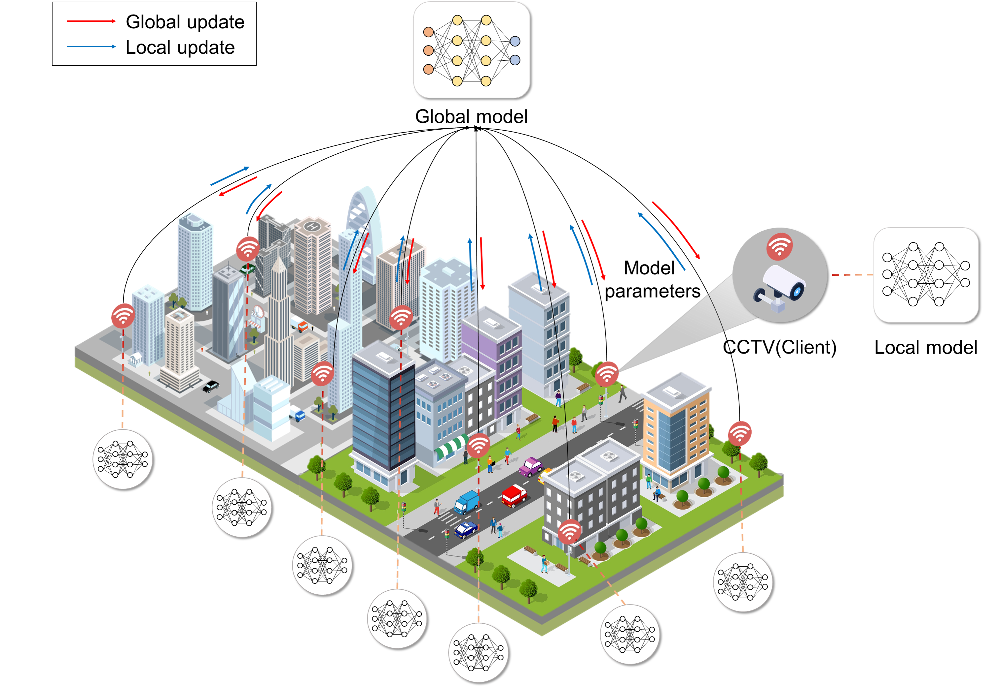
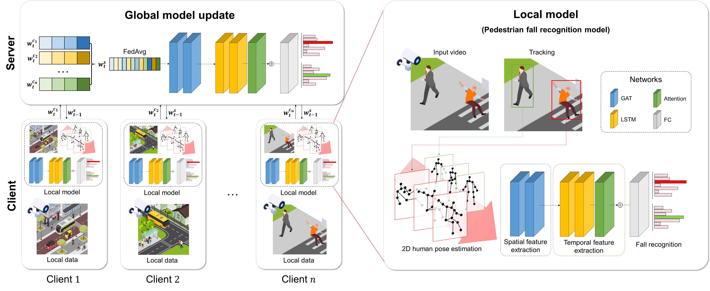

# Fed-PFR
Federated Learning-based Road Surveillance System in Distributed CCTV Environment: Pedestrian Fall Recognition using Spatio-Temporal Attention Networks



**Figure 1: Concept of Federated Learning**

The figure demonstrates the core concept of federated learning in a distributed CCTV environment:
- **Local Training**: Each CCTV node processes local video data and trains a model using spatio-temporal attention mechanisms without sharing raw data.
- **Federated Aggregation**: The local models periodically send updated parameters to a central server for aggregation.
- **Global Model**: The server builds a global model by combining the parameters, enabling collaborative learning across all nodes.
- **Privacy Preservation**: This approach ensures data privacy by keeping sensitive video data on local devices while benefiting from collective intelligence.

This architecture is designed to address the challenges of scalability, real-time performance, and data privacy in pedestrian fall detection systems.

## Abstract
Intelligent CCTV systems are highly effective in monitoring pedestrian and vehicular traffic and identifying anomalies in the roadside environment. In particular, it is necessary to develop an effective recognition system to address the problem of pedestrian falls, which is a major cause of injury in road traffic environments. However, the existing systems have challenges such as communication constraints and performance instability. In this paper, we propose a novel fall recognition system based on Federated Learning (FL) to solve these challenges. The proposed system utilizes a GAT combined with LSTM and attention layers to extract spatio-temporal features, which can more accurately identify pedestrian falls. Each road CCTV works as an independent client to generate local data, and the server aggregates these models to learn a global model. This ensures robust operation in different views and environments, and solves the bottleneck of data communication and security challenges. We validated the feasibility and applicability of the FL-based fall recognition method by implementing the prototype and applying it to the UP-FALL benchmark dataset, which is widely used for fall recognition.



**Figure 2: The overall structure of the proposed FL-based fall recognition model**
The overall structure of the proposed FL-based fall recognition model is as follows: First, at the beginning of each round $t$, client $c$ downloads the global model weights $w_{t-1}^s$ of the previous round. Then, each client trains a local model and uploads the trained weights $w_t^{c_i}$ ($i=1, 2, \ldots, n$) to the server. The server uses the FedAvg algorithm to aggregate the global model weights $w_t^s$. Each local model consists of a network that recognizes pedestrian falls (see local model, right in the figure).

This repository contains demo code for implementing the system. The dataset can be downloaded from the site [Link](https://sites.google.com/up.edu.mx/har-up/).

## System Requirements
- **Operating System**: Ubuntu 22.04.3 LTS
- **CPU**: 12th Gen Intel(R) Core(TM) i7-12700F
- **GPU**: NVIDIA GeForce RTX 4070 (12GB VRAM)
- **System Memory (RAM)**: 32GB

## Usage

### Requirements
First, clone the repository
```bash
git clone https://github.com/Kim-Byeong-Hun/Fed-PFR.git
```
Then download the required packages.
```bash
pip install -r requirements.txt
```
### Preparation
First, download the dataset from [Link](https://sites.google.com/up.edu.mx/har-up/).

The dataset folder should be saved in the following format.
```
UP-FALL
 |─ Subject1
 │   └─ Activity1
 |       |─ Camera1
 |       |   |─ Subject1Activity1Trial1Camera1
 |       |   |  |─ 2018-07-04T12_04_17.738369.png
 |       |   |  |─ 2018-07-04T12_04_17.790509.png
 :       :   :  :
 |       |   |  └─ 2018-07-04T12_04_27.619046.png
 |       |   |- Subject1Activity1Trial1.csv
 :       :   :  :
```

### Pre-processing
Convert the original files of the UP-FALL dataset into a systematically organized folder structure. The following command organizes the data in the **UP-FALL** folder into the **UP-FALL-output** folder.
```bash
python data/folder.py --base_folder UP-FALL --output_folder UP-FALL-output
```

Preprocessing is performed using the YOLOv8 model based on the organized data. In this process, image data is loaded from the specified input folder to extract keypoints feature, and the **cropped image and keypoint file are saved**. The results are saved in the **UP-FALL-output2** folder.

Please refer to the description in the code(pre-processing.py) for additional options for saving.
```bash
python data/pre-processing.py --input_folder UP-FALL-output --output_folder UP-FALL-output2 --model_path ./yolov8m-pose.pt --save_options crop keypoints
```

Finally, the organization of folders is as follows:
```
UP-FALL-output2
 |─ Camera1
 |   |─ Falling backward_Subject1Activity3Trial1Camera1
 |   |   |─ crop_2669_2018-07-04T12_06_21.853279.png
 |   |   └─ keypoints_2018-07-04T12_06_21.853279.txt
 :    :                        :
 │   └─ Falling backward_Subject1Activity3Trial2Camera1
 |─ Camera2 
 |   |─ Falling backward_Subject1Activity3Trial1Camera2
 :       :   :  :
```

### Model Training Execution

#### 1. Centralized Learning (`main_centralized.py`)

Centralized Learning involves training the entire dataset on a single centralized server.  
This process uses pre-processed data stored in the `UP-FALL-output2` folder to train a GAT-LSTM model.

##### Example Command:
```bash
python main_centralized.py --data_paths UP-FALL-output2/Camera1 UP-FALL-output2/Camera2 --sequence_length 40 --batch_size 16 --num_epochs 100 --output_dir outputs_centralized
```
Parameter Descriptions:
- `data_paths`: Specifies the paths to the data for training. Multiple paths can be provided separated by spaces.
- `sequence_length`: Specifies the sequence length. Default is 40.
- `batch_size`: Specifies the batch size. Default is 16.
- `num_epochs`: Specifies the number of training epochs. Default is 100.
- `output_dir`: Specifies the directory to save the training results (model and logs).

#### 2. Federated Learning (`main_federated.py`)

Federated learning trains the model locally on client data (e.g., per camera) and only shares model updates with the central server.
This process uses client data to perform federated training with methods such as `FedAvg`, `FedProx`, and `FedNova`.

##### Example Command:
```bash
python main_federated.py --method FedAvg --num_rounds 100 --mu 0.01 --log_file outputs_federated/fedavg_training_log.txt
```
Parameter Descriptions:
- `method`: Specifies the federated learning method. Options are FedAvg, FedProx, and FedNova. Default is FedAvg.
- `num_rounds`: Specifies the number of federated learning rounds. Default is 100.
- `mu`: Specifies the proximal term coefficient for FedProx. Default is 0.01.
- `log_file`: Specifies the path to save the training log file.

### Result

#### Performance Comparison of Federated Learning Algorithms

The following table shows the performance comparison of different federated learning algorithms under two scenarios:

| **Task**         | **Methods** | **Accuracy (%)** | **Precision (%)** | **Recall (%)** | **F1-score** |
|-------------------|-------------|------------------|-------------------|----------------|--------------|
| **Scenario 1**    | FedProx     | 97.73            | 95.28             | 98.55          | 96.79        |
|                   | FedNova     | 91.36            | 88.02             | 92.50          | 89.76        |
|                   | **FedAvg**  | **99.08**        | **97.09**         | **99.01**      | **98.04**    |
| **Scenario 2**    | FedProx     | 78.18            | 77.09             | 74.28          | 72.46        |
|                   | FedNova     | 87.73            | 83.86             | 82.86          | 80.70        |
|                   | **FedAvg**  | **93.14**        | **90.16**         | **90.04**      | **89.75**    |

Scenario 1: Binary, Scenario 2: Multi

#### Results of Centralized and Federated Learning Approaches

The following table compares the performance of centralized and federated learning methods under two scenarios:

| **Task**         | **Methods**          | **Accuracy (%)** | **Precision (%)** | **Recall (%)** | **F1-score** |
|-------------------|----------------------|------------------|-------------------|----------------|--------------|
| **Scenario 1**    | Centralized Learning | 99.54            | 99.70             | 99.03          | 99.36        |
|                   | Federated Learning   | 99.08            | 97.09             | 99.01          | 98.04        |
| **Scenario 2**    | Centralized Learning | 93.59            | 91.35             | 91.91          | 91.49        |
|                   | Federated Learning   | 93.14            | 90.16             | 90.04          | 89.75        |

## Reference
- [UP-Fall](https://sites.google.com/up.edu.mx/har-up/)
- [YOLOv8](https://github.com/ultralytics/ultralytics)

## Citation
Please consider citing our paper if it helps your research.
```
To be released soon
```
